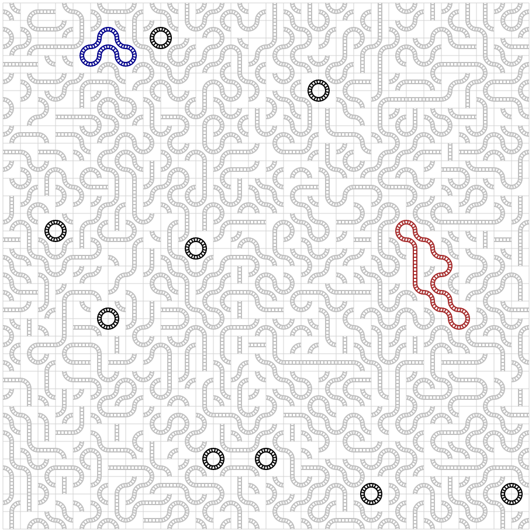

# ALGO ARTIS プログラミングコンテスト2022 (AtCoder Heuristic Contest 010)

2022.4/24  
[AHC010](https://atcoder.jp/contests/ahc010/tasks/ahc010_a)  
今回はrandomだけであとはtimeを使う練習などをしていました。  
当たり前ですがrandomだと全然輪が大きくなりませんでした。

## 最終結果
score : 21,544 (100 testcase)  
ranking : 282 / 678 人  
performance : 1356 (水)  
Rating : 846 -> 1051 (緑)

 

## Results
[main.py](main.py) : 後から提出ファイルの差分をまとめたもの (1.py ~ 10.py)

### Submitted logs
100 testcase (PyPy)

| file | score | time | 何をしたか |
| ---- | ---- | ---- | ---- |
| [1.py](submitted_logs/1.py) | 0 | TLE | 900個randomに回転数を決めてスコアを計算してmaxのものを採用。10000回試してみたらTLE。 |
| [2.py](submitted_logs/2.py) | 10,984 | 903ms | 100回にしたらAC。 |
| [3.py](submitted_logs/3.py) | 14,840 | 382ms | 500回。 |
| [4.py](submitted_logs/4.py) | 0 | TLE | 回数の上限が分からないのでtimeを利用して1.9sを超えたらループを止めてみるとTLE。timeの誤差だと思われる。 |
| [5.py](submitted_logs/5.py) | 20,652 | 1734ms | 1.5sにしてみたら程よく試行してくれた。 |
| [6.py](submitted_logs/6.py) | 20,820 | 1885ms | 1.7s。 |
| [7.py](submitted_logs/7.py) | 21,176 | 1976ms | 1.8s。このあたりがギリギリのよう。 |
| [8.py](submitted_logs/8.py) | 21,544 | 1927ms | 提出時の得点で決まるらしいので、randomだしもう1度7.pyを提出して終了。 結局1.8sで5000～6000回試せていた。 どこかで試行回数を増やしてもあまり結果が変わらないラインがありそう。DFSや最小円を作ってから繋げる、一旦向きを全部揃えてからどうにか繋げる、など色々方法はありそうと思いながらビジュアライザのmanual modeで遊んでいた…。 |

 

### ビジュアライザ(seed=0)
