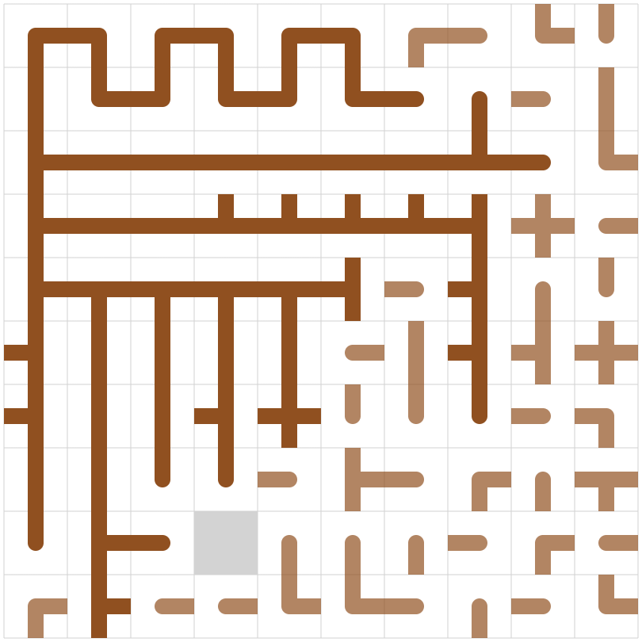

# AtCoder Heuristic Contest 011

2022.5/28 12:00 - 2022.6/5 19:00  
Public : 2022.6/5 19:00~
[AHC011](https://atcoder.jp/contests/ahc011/tasks/ahc011_a)  

## 最終結果
score :  (3000 testcase)  
ranking :  /  人  
performance :  ()  
Rating : 1051 ->  ()

 

## Results
[sliding-tree-puzzle/src/main.rs](sliding-tree-puzzle/src/main.rs) : 提出ファイルの差分がまとまったもの (1.rs ~ 6.rs)

### Submitted logs
50 testcase (Rust)

| file | score | time | 何をしたか |
| ---- | ---- | ---- | ---- |
| [1.rs](sliding-tree-puzzle/src/bin/1.rs) | 2,869,199 | 4ms | tターン何もしない |
| [2.rs](sliding-tree-puzzle/src/bin/2.rs) | 4,656,724 | 38ms | tターンrandomで判定に問題ないかcheck |
| [3.rs](sliding-tree-puzzle/src/bin/3.rs) | 8,257,596 | 38ms | プラモデル風に作ろうとするもバグが取れないまま一旦提出 |
| [4.rs](sliding-tree-puzzle/src/bin/3.rs) | 10,254,736 | 40ms | 3.rsのバグを修正。やっと少し狙い通りに動いていそう。 |
| [5.rs](sliding-tree-puzzle/src/bin/3.rs) | 7,781,948 | 42ms | 4.rsに最短距離の目的tileを採用を追加したがどこかがおかしい。 |
| [6.rs](sliding-tree-puzzle/src/bin/3.rs) | 9,737,079 | 44ms | 修正する時間がなく4.rsを最終提出として終了 |

 

### ビジュアライザ(seed=4)

