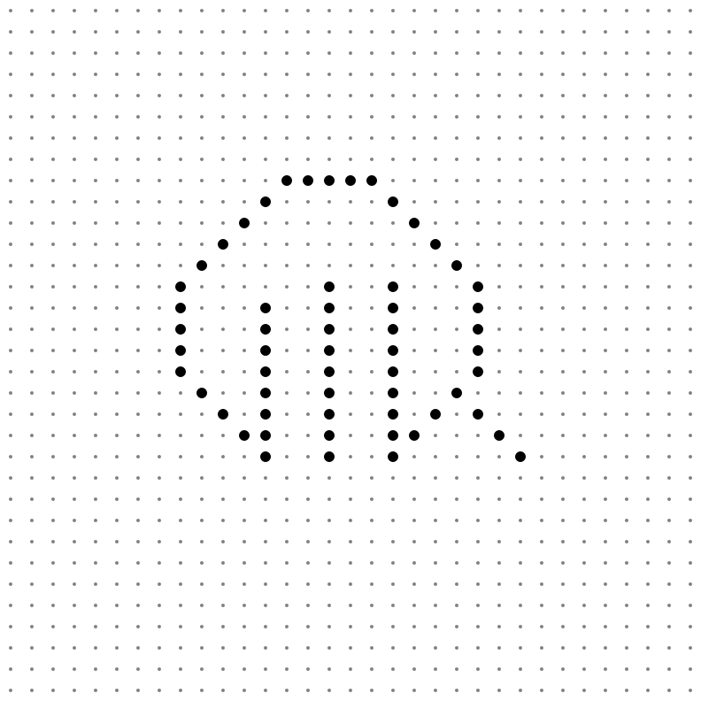

# estieプログラミングコンテスト2022 (AtCoder Heuristic Contest 014)

2022.9/17 15:00 - 2022.10/1 19:00  
Public : 2022.10/1 19:00~
[AHC014](https://atcoder.jp/contests/ahc014/tasks/ahc014_a)  

## 最終結果
score : 1,326,049,408 (2000 testcase)  
ranking : 338 / 727 人  
performance : 1274 (水)  
Rating : 1097 -> 1143 (緑)

 

## Results
[src/main.rs](src/main.rs) : 提出ファイルの差分がまとまったもの (1.rs ~ 5.rs)

### Submitted logs
50 testcase (Rust)

| file | score | time | 何をしたか |
| ---- | ---- | ---- | ---- |
| [1.rs](src/bin/1.rs) | 14,048,321 | 6ms | 一旦何もしない |
| [2.rs](src/bin/2.rs) | 33,271,877 | 512ms | 長方形の4点目として選べるp1を全探索し重みの高い順に採用する。4.0sec試す。 |
| [3.rs](src/bin/3.rs) | 33,271,877 | 497ms | 2.rsを4.9secでお試し。手元では僅かに上がるのにscore少しも変わらない謎。 |
| [4.rs](src/bin/4.rs) | 33,712,711 | 4904ms | 重みが高い順にその周で作れる1番小さい四角を採用。微増…。 |
| [5.rs](src/bin/5.rs) | 33,712,711 | 457ms | 内容特に変更なし。無駄に回してるループを修正。4.rsでもう置ける場所がなかったら終了。 |

 

### 改善点
上位何個かの状態を持って最善を採用をしたかった。  
小さい正方形を作るのが得なのはそうなので、ランダムに小さいの優先がこの方針よりは良かったらしい。  

 

### ビジュアライザのGIF(seed=0)
  
